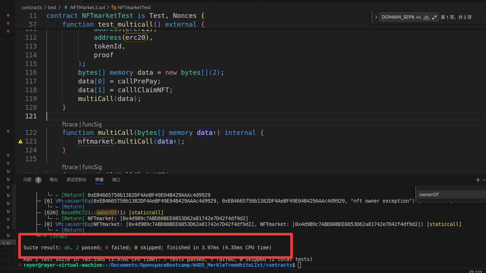

# 实现一个 AirdopMerkleNFTMarket 合约(假定 Token、NFT、AirdopMerkleNFTMarket 都是同一个开发者开发)，功能如下：

## 基于 Merkel 树验证某用户是否在白名单中
在白名单中的用户可以使用上架（和之前的上架逻辑一致）指定价格的优惠 50% 的Token 来购买 NFT， Token 需支持 permit 授权。

## 要求使用 multicall( delegateCall 方式) 一次性调用两个方法：

* permitPrePay() : 调用token的 permit 进行授权
* claimNFT() : 通过默克尔树验证白名单，并利用 permitPrePay 的授权，转入 token 转出 NFT 。
  请贴出你的代码 github ，代码需包含合约，multicall 调用封装，Merkel 树的构建以及测试用例。

## 运行测试用例截图

## 生成merkle tree

在目录文件index.js下
